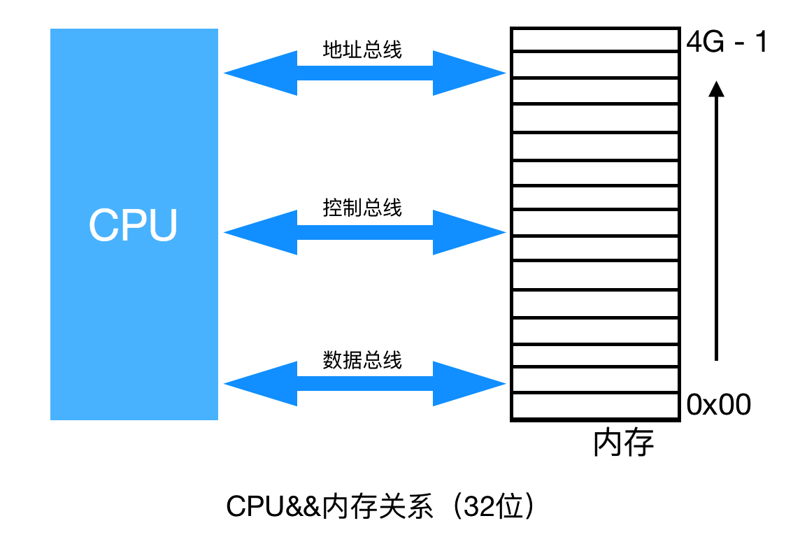

# 数据结构（一）--入门和预备知识

## 1. 概述

**数据结构定义:**

我们如何把现实中大量而复杂的问题以特定的数据类型和特定的存储结构保存到主存储器(内存)中,以及在此基础上为实现某个功能(如元素的CURD、排序等)而执行的相应操作，这个相应的操作也叫算法。

数据结构 = 元素的存储 + 元素的关系的存储
算法 = 对数据存储的操作

**算法:**

算法就是：解决问题的方法和步骤

衡量算法有如下标准:

1. 时间复杂度
    <br>程序要执行的次数，并非执行时间
2. 空间复杂度
    <br>算法执行过程中大概要占用的最大内存
3. 难易程度(可读性)
4. 健壮性 

## 2. 数据结构的特点和地位

**地位:**

数据结构处于软件中核心的地位。

如计算机内存中栈和堆的区别，不懂数据结构的人可能会认为内存就是分两大部分，一块叫栈，一块叫堆，显然这是非常肤浅且不正确的结论。

实际上如果一块内存是以压栈出栈的方式分配的内存，那么这块内存就叫栈内存，如果是以堆排序的方式分配的内存，那么这块内存就叫堆内存，其最根本的区别还是其内存分配算法的不同。

例如，函数的调用方式也是通过`压栈出栈`的方式来调用的，或者操作系统中多线程操作有`队列`的概念，`队列`用于保证多线程的操作顺序，这也是数据结构里面的内容、或者计算机编译原理里面有`语法树`的概念，这实际上就是数据结构里面的`树`，比如软件工程、数据库之类都有数据结构的影子。

**特点:**

数据结构修炼的是内功，并不能直接立竿见影的可以解决现实问题，但是有了这门内功会在其他方面的学习中对你大有益处。

## 3. 预备知识（C语言）

学习数据结构应该具备如下知识：

- 指针
- 结构体
- 动态内存的分配和释放
- 跨函数使用内存

本小节主要介绍学习数据结构应该有的基础，并对相关知识稍作讲解。

### 指针

指针是 C语言 的灵魂，重要性不需多言。

**指针定义**

地址：
　　地址是内存单元的编号
　　其编号是从 0 开始的非负整数
　　范围： 0 -- 0xFFFFFFFF (2^32 - 1)  **注：此指x86平台，x64平台下最大内存地址为 (2^64 - 1)** 

指针：
　　指针就是地址，地址就是指针。
　　指针变量是存放内存单元地址的变量,它内部保存的值是对应的地址,地址就是内存单元的编号(如内存地址值：0xffc0)。
　　指针的本质是一个操作受限的非负整数
　　
在计算机系统中，CPU 可以直接操作内存，关于 CPU 对内存的操作与控制原理可以简单理解如下图


地址线 ： 确定操作哪个地址单元
控制线 ： 控制该数据单元的读写属性
数据线 ： 传输 CPU 和内存之间的数据

**指针的分类**

1. 基本类型的指针

    ```objc
    int i = 10;  // 定义一个 整形变量 i 初始值 10
    
    int *p = i;  // 定义一个 整形的指针变量 p , 变量 p 指向 i 的地址    
    
    int *p;      // 这两行等价于上面一行
    p = &i;
    
    1. p 存放了 i 的地址，我们就可以说“ p 指向了 i” ，但 p 和 i 是两个不同的变量，修改一方不会影响另一个的值。
    2. *p 等价于 i ，i 等价于 *p;两者是一块内存空间，里面的值一变具变。
    ```
    
2. 指针和函数
    
    ```objc
    // 修改外部实参的值
    void func(int * p)
    {
        *p = 100;   // 函数内修改外部变量的值   
    }
    
    // 修改外部实参的值，二级指针的值
    void func2(int ** p)
    {
        *p = 100;   
        // 函数内修改外部变量的值 ，这里实际修改的是指针的内部的地址，这里直接自己修改并不严谨也不安全，只是为了表达意思  
    }
    
    int main(void)
    {
        // 修改外部实参
       int i = 10;
       func(&i);
       printf("i = %d",i);
       
       // 修改外部二级指针
       int *p = i; // 等价于 int *p; p = &i;
       func(&p);
       printf("i = %d",i);
       
       return 0;
    }
    
    // 通过函数调用，改变函数外部变量（实参）的值

    ```
3. 指针和数组

    【指针】 和 【一维数组】
    
    ```objc
     int a[5] = {1,2,3,4,5 };
     
     a[3] == *(a + 3)  
     // 等价于 a[3] == *(3 + a) == 3[a];
     // 3[a] 这种写法只是不常用，从原理上来说是正确的 a 等价于 a[0];
     // a 是数组中第一个元素，每个元素占用内存单位长度相同，
     // a[i] 中的 i 实际代表的是单位长度的倍数
    ```
    
    - 数组名:<br>
    　　一维数组名是个指针常量(它的值不可变) <br>
    　　它存放的是该一维数组的第一个元素的地址(一维数组名指向其第一个元素)
    　　
    - 下标和指针的关系:
    　　(1)、 `a[i]` 等价于 `*(a + i)`
    　　(2)、假设指针变量的名字为 p, 
    　　则 `p + i` 的值为 `p + i * (p 所指向的变量所占字节数)`
    　　(3)、每个下标表示的是第 i+1 个元素，根据元素类型分配的字节长度不同(int 类型4个字节)，每个字节都有对应的内存地址编号，指针变量 p 保存的是该元素首字节的地址。
  
    - 指针变量的运算:　
        　　指针变量不能相加、相乘、相除
        　　如果两指针变量属于同一数组，则可以相减
        　　指针变量可以加减一个整数，前提是最终结果不能超过指针最大可访问范围
        　　    　　

    ```objc
    // 指针变量的运算
    p + i 的值是 p + i*(所指向的变量所占字节数)
    p - i 的值是 p - i*(所指向的变量所占字节数)
    p++   等价于 p + 1
    p--   等价于 p - 1
    
    
    // 下面是一个通过函数修改数组内部元素
    void my_Array(int *a , int length)
    {
        for(int i = 0; i < length; i++)
        {
            *a[i]++;  // 给每个元素加 1
        }
    }
    
    int main(void){
    
        int a[5] = {1,2,3,4,5};
        my_Array(a , 5); // 调用
    }
    
    ```   
    
### 结构体

**为什么会出现结构体**、

为了表示一些复杂的数据，而普通的基本数据无法满足要求.

**什么叫结构体**
结构体是用户根据实际需要，自己定义的复合数据类型

```objc
// 如学生类型
struct Student{
   int age;
   char * name; // name 不同，赋值方法不同
   char name2[100]; // 这个只能 strcpy(s.name2, "zhangwangdsd"); 字符串拷贝
   double height;
};
```

**如何使用结构体**

总结起来有两种结构体的使用方式：直接使用 && 通过指针使用
struct Student ss = {12,"xiaoyou",1.73,"xiaozhang"};
struct Student *pst = &ss;

ss.name ;  这里直接操作结构体本身
pst -> name ;   这里通过指针地址操作，更加节省空间


```c
struct Student{ // 自定义结构体
    int age;
    char * name;
    double height;
    char name2[100];
};

int main(void) {

   struct Student s = {12,"xiaoyou",1.73,"xiaozhang"};

// 直接使用
   printf(" age = %d \n name = %s \n height = %.2f \n",s.age,s.name,s.height);

   s.age = 21;
   s.name = "xiaozhu";
   strcpy(s.name2, "zhangwangdsd");  // 字符串拷贝
   s.height = 1.70;

   printf(" age = %d \n name = %s \n height = %.2f \n %s \n",s.age,s.name,s.height,s.name2);

   // 以指针的方式使用
   struct Student *pst = &ss;
   pst -> name = "my new name";
   
   printf(" name = %s\n",pst->name);
   printf(" name = %s\n",(*pst).name);
   
// pst -> name 等价于 (*pst).name ,
// 而(*pst).name 又等价于 ss.name
// 所以 pst -> name 等价于 ss.name

   return 0;
}
```

**注意事项**
结构体变量的类型为： struct Student
结构体变量不能加减乘除，但是能够相互赋值
普通结构体变量和结构体指针变量作为函数传参的问题

```c
typedef struct Student{ // 结构体定义
    int age;
    char * name;
    char name2[100];
    double height;
}myStudent;

// 直接传递整个结构体数据，耗时 && 浪费内存空间
void func(struct Student st);
// 直接传递 只占用 4 byte 的指针，省时效率也高 <推荐用法>
void func2(struct Student * pst);

int main(void){

    myStudent ss = {12,"xiaoyou",1.73};
    func(ss);
    func2(&ss);
    return 0;
}

void func(struct Student st){
    
    printf("age = %d \n name = %s",st.age,st.name);
}

void func2(struct Student * pst){
    
    printf("age = %d \n name = %s",(*pst).age,(*pst).name);
    printf("age = %d \n name = %s",pst->age,pst->name);
}

```

### 动态内存分配和释放

平时直接创建数组的写法都是静态创建，创建完毕之后在整个程序的运行过程中，会固定占用对应的内存，不仅会造成内存空间浪费，还无法动态添加元素，所以局限性很大，而程序中我们为了避免这种情况，应该使用动态的方式创建和销毁数组。

```c
// 静态创建数组
int a[5] = {1,2,3,4,5};
```

**动态构造一维数组**

动态构造一个 `int 型`的一维数组。

```c
int *p = (int *)malloc(int length);

1. void * malloc(size_t __size) 函数,只有一个 int 类型的形参，表示要求系统分配的字节数
2. malloc 函数的功能是请求系统 length 个字节的内存空间，如果请求完成则返回的是第一个字节的地址，
    如果请求不成功，则返回NULL
3. malloc 函数能且只能返回第一个字节的地址，所以我们需要把没有实际意义的第一个字节地址（干地址）转化为一个有实际意义的地址，
    所以 malloc 前面必须加(数据类型 *)，表示把这个无意义的地址转化为对应类型的地址
    
    实例：
        int *p = (int *)malloc(50);
        表示将系统分配的 50 个字节的第一个字节的地址转化为 int 类型的地址，准确的说是转化为 4 个一组的地址的首地址，
        这样 p 就指向了第一个四个字节··· p+i 就指向了第 i+1 个四个字节，p[0],p[i]也就分别是第一个，第i+1个元素。
        
        double *p = (double *)malloc(80);
        表示将系统分配的 80 个字节的第一个字节的地址转化为 double 类型的地址，准确的说是转化为 8 个一组的地址的首地址，
        这样 p 就指向了第一个八个字节··· p+i 就指向了第 i+1 个八个字节，p[0],p[i]也就分别是第一个，第i+1个元素。
        
4. free(p);
    释放 p 所指向的内存，而不是释放 p 本身所占用的内存
        
```
代码示例如下：

```c
void test2(void)
{
    int len;
    printf("请输入你要动态创建的数组长度:");
    scanf("%d",&len);
    
    int *pArr = (int *)malloc(len); // 动态创建数组
    *pArr = 4;      // 相当于 a[0] = 4;  这里 pArr 就等于数组首地址，等于数组名
    pArr[2] = 5;    // 相当于 a[2] = 5;
    
    printf("pArr[0] = %d \npArr[2] = %d\n",pArr[0],pArr[2]);
    
    free(pArr);     // 使用完毕，释放对应的数组空间 
}
```

### 跨函数使用内存

在函数内部分配的局部变量，在函数调用完成之后就会被系统回收，其内存也会消失。但是程序中常常需要定义一块内存，当我们用完之后再会回收。如 OC 语言中对象。所以需要保存住分配的内存，应该用动态分配内存，当用完之后再手动释放。这也是C语言的一个不足之处：内存需要我们手动创建和手动释放，这也是 OC 语言在开发 iOS 程序时候，我们所讲的MRC。【苹果也发现了这个不足，于 iOS 5 的时候推出了ARC 】

下面是一个跨函数使用内存的例子：

```c
// 这个例子已经非常有面向对象的味道了

typedef struct Student{     // 自定义 student 结构体
    int age;
    char * name;
}myStudent;

myStudent * createStudent(void); // 创建 student 
void showStudent(myStudent *);   // 输出 student

int main(void) {

    myStudent *p = createStudent();  // 创建 student 
    showStudent(p);                  // 输出 student
    
    return 0;
}

myStudent * createStudent(void)
{
    myStudent *p = (myStudent *)malloc(sizeof(myStudent));
    p->age = 20;
    p->name = "xiaoyou";
    return p;
}

void showStudent(myStudent *p)
{
    printf("student.age = %d \nstudent.name = %s\n",p->age,p->name);
}

```

## 4. 小结

本文主要讲解了数据结构的定义和简介。
回顾了学习数据结构应该具备的一些 C语言 的基础知识，如指针、结构体、和内存等。

后面会继续开始对数据结构的讲解。


