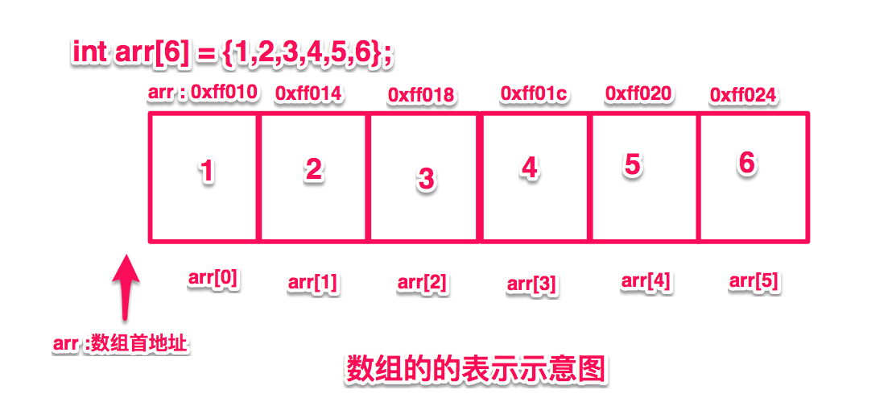
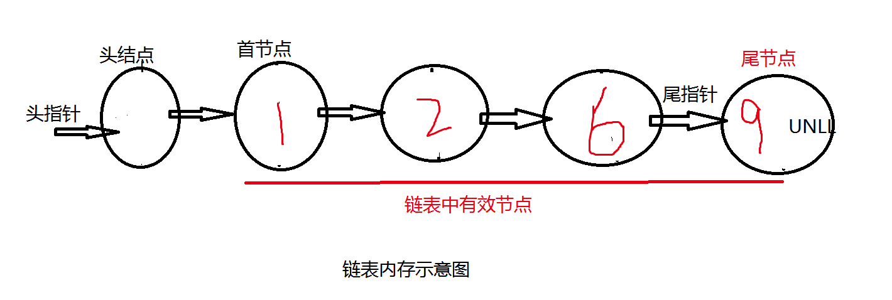
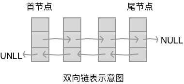
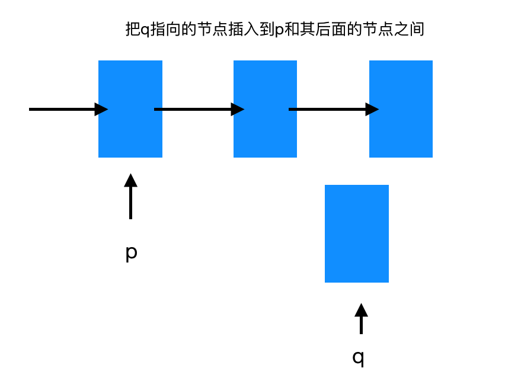

# 数据结构(二)--数组和链表

数据结构主要可以分为两大模块：

- 线性结构
- 非线性结构

本文主要开始讲线性结构。

## 什么是线性结构

线性结构，顾名思义，就是这些数据所有节点都能被一根线(指针)联系起来的一种结构。

**线性结构的存储方式：**

1. 连续存储：【数组】
2. 离散存储：【链表】

**线性结构的常见应用方式：**

1. 栈
2. 队列

**专题 :【递归】**

## 数组和链表

本小节学习数组和链表，从底层去了解和实现数组与链表，并分析两者对应的优缺点

### 数组

数组是最常见的链式存储结构，它是一段连续的内存空间，在内存中我们可以简单表示为下图样式

<!--数组内存示意图，，，数组中元素类型相同，大小相等-->


通过上图我们可以把代码中`int arr[6] = {1,2,3,4,5,6};`执行的操作从内存中脑补出来，同时我们可以简单分析一下，数组应该有的一些基本使用。如

- 初始化、
- 添加新元素、
- 插入新元素、
- 删除某个元素、
- 判断是否为空数组、
- 是否是满数组、
- 排序
- 倒序
- 查询是否包含某个元素
- ······

本小节就带着你手把手实现一个简单的数组的封装，借此来了解数组的数据结构以及内部的一些基本算法知识。这里就简单的以一个 int 类型的数组来示例，后面学到泛型的时候便可更加好的理解数组的实现。

首先简单分析一下数组中基本的属性，我们有上面的数组内存中的逻辑图可以确定数组有对应的内存空间，有一个内存起始地址，因为系统分配内存的时候长度是一定的，所以数组中有一个表示最大长度的属性，数组中的元素也可能会根据实际个数不定，所以肯定有元素个数的标记，这个标记不仅可以拿来查看数组元素个数，也能确定了元素的下标。通过简单的分析我们可以总结数组中基本的属性如下：

- 【pBase】 数组首字节地址
- 【length】 数组长度(决定分配的内存大小)
- 【count】 数组中有效元素个数

<!--下面就开始手把手分析和实现一个数组-->

下面就根据上面的分析来实现一个简单的数组，这里只说一下思路，完整代码请在这里下载[数组实现代码](https://github.com/xiaoyouPrince/DataStructure)

```c
// 定义个数组
typedef struct Array {
    int length; // 数组长度
    int count;  // 数组当前元素数 count
    int *pBase; // 数组的首字节地址
}* PMyArray,MyArray; //两个别名，PMyArray 类似java中类名，定义的对象不带 * , MyArray类似于OC中的类型，定义的对象带 * 。

// 要实现的一些基本方法

/** 初始化数组*/
void init_Arr(MyArray *pArr, int len);
/** 追加数组*/
bool append_Arr(MyArray *pArr, int value);
/** 插入数组*/
bool insert_Arr(MyArray *pArr, int index , int value);
/** 删除数组*/
bool delete_Arr(MyArray *pArr, int index , int * pVal);
/** 是否满载*/
bool is_full(MyArray *pArr);
/** 是否为空*/
bool is_empty(MyArray *pArr);
/** 排序数组*/
void sort_Arr(MyArray *pArr);
/** 展示数组*/
void show_Arr(MyArray *pArr);
/** 倒序数组*/
void inversion_Arr(MyArray *pArr);

/** 获取一个默认初始化的数组*/
MyArray * get_Arr(void);


int main(void) {

    MyArray arr;        // 声明
    int len = 6;        // 定义数组长度
    init_Arr(&arr,len);     // 初始化
    
    // 添加元素
    int time = 0;
    while (time < len) {
        append_Arr(&arr, 100 + time);
        time++;
    }
    
    insert_Arr(&arr, 6, 200);  // 插入元素
    insert_Arr(&arr, 7, 300);
    insert_Arr(&arr, arr.count, 400);
    insert_Arr(&arr, 0, 500);
    insert_Arr(&arr, 3, 600);

    show_Arr(&arr);         // 打印数组元素
    
    int val;
    //delete_Arr(&arr, 3 ,NULL);    // 删除第三个元素
    delete_Arr(&arr, 3 ,&val);
    printf("被删除的元素是 %d \n",val);
    
    show_Arr(&arr);         // 打印数组元素
    
    inversion_Arr(&arr);    // 倒序排列一下
    
    show_Arr(&arr);         // 打印数组元素
    
    sort_Arr(&arr);         // 排序数组
    
    show_Arr(&arr);         // 打印数组元素
    
       
#pragma mark -- OOP
    
    // 类似于 OC 中的面向对象用法
    MyArray * array3 = get_Arr();
    printf("array3 address is %p\n",array3);
    printf("array3 address is %p\n",&array3);
    show_Arr(array3);

    // 类似于 java 中的面向对象用法
    PMyArray myArray4 = get_Arr();
    printf("array4 address is %p\n",myArray4);
    printf("array4 address is %p\n",&myArray4);
    show_Arr(myArray4);

    return 0;
}

// 初始化数组，对内部元素基本初始化
void init_Arr(MyArray *pArr,int len){
    
    (*pArr).pBase = (int *)malloc(sizeof(int) * len); //  先分配一段内存空间，长度为 len * int长度。
    if(pArr->pBase == NULL)
    {
        printf("内存分配失败，初始化失败\n");
        exit(-1); // 终止程序
    }else
    {
        pArr->length = len;
        pArr->count = 0;
    }
    return;
}

/**
 实现数组插入
 
 1. 判断插入下标是否越界
 2. 如果插入前数组已经满了，就增大一个长度，重新插入
 3. 如果插入前数组未满
     3.1 当插入位置小于最大元素下标，先把要插入目标点后面的元素往后移动一个单位。 如在{1，2，4，5}中第3个位置插入3，结果为{1，2，3，4，5}
     3.2 当插入位置大于等于最大元素下标，直接在原来数组后面add最后一个元素。 如在{1，2}中第5个位置插入 3 结果为{1，2，3}

 @param pArr 要操作的数组的指针
 @param index 要插入的index 即下标
 @param value 要插入的值
 @return 返回插入成功/失败
 */
bool insert_Arr(MyArray *pArr, int index , int value){
    // 为减少篇幅，建议直接下载源码
}

/**
 实现数组删除某个元素
 并可以从外部获得被删除元素的值
 
 1. 判断删除下标是否越界
 2. 判断原数组是否为空
 3. 如果删除前先保存对应 index 的值赋值给外部变量
    把要删除目标点后面的元素往前移动一个单位。 如在{1，2，3，4，5}中第3个位置删除3，结果为{1，2，4，5}
 
 @param pArr 要操作的数组的指针
 @param index 要伤处的index 即下标
 @param pVal 要删除值的地址
 @return 返回删除成功/失败
 */
bool delete_Arr(MyArray *pArr , int index ,int *pVal)
{
    // 为减少篇幅，建议直接下载源码
}

/**
 往数组尾部添加元素

 @param pArr 数组指针
 @param value 要添加的元素值
 @return 添加成功/失败
 */
bool append_Arr(MyArray *pArr,int value){
    
    if (!is_full(pArr)) { // 判断是不是已经满了数组
        // 数组未满，添加
        pArr->pBase[pArr->count] = value;
        pArr->count++;
        return true;
        
    }else{
        printf("数组已经满了,无法从尾部追加元素，请尝试从前面插入\n");
        return false;
    }
    
}

// 为了控制篇幅，这里不再进行罗列，可以直接去下载源码对比查看

```

<!--手把手实现数组-->

数组的内存结构是线性的，通过这个例子的实现也更加容易理解。数组是一种常用的也是固定内存排序线性结构。然而在很多情况下是数据在内存中并不会这样线性的去排布。
> 虽说C语言是面向过程的语言，事实上这只是一种表象，学了数据结构其实我们可以发现我们完全可以用 C语言 实现面向对象语言的特性。事实上几乎所有的操作系统内核、机器语言底层、编译器层面都是使用 C语言 来实现的。


### 链表

链表是一种元素内存空间离散排列的线性数据结构。它的内存存储示意图大致如下：

<!--一个链表的内存示意图-->



链表是整个数据结构的一个基础，后面的线性结构几乎都需用到链表的知识，下面就从这几个方面来介绍链表。

- 定义
- 分类
- 算法
- 优缺点

**【链表定义/特点】**
n个节点离散分配
彼此通过指针相连
每个节点只有一个前驱节点，每个节点只有一个后续节点
首节点没有前驱节点，尾节点没有后续节点

**首节点：**
第一个有效节点

**尾节点：**
最后一个有效节点

**头结点：**
第一个有效节点前面的那个节点，头结点并不存放有效数据，加头结点的目的主要是为了方便对链表的操作，头结点的数据类型和首节点一样

**头指针：**
指向头结点的指针变量

**尾指针：**
指向尾节点的指针变量


**确定一个链表需要的最少的参数有哪些？**
根据链表的示意图可以简单推出来所有该链表的信息。
实际上只需要一个关键信息：**头指针**
因为我们通过头指针就可以推算出链表的其他所有信息。

**【节点的表示】**


```c
// 代码的表示如下
typedef struct Node{
    int data;     //数据域
    struct Node *pNext;     // 指针域 - 指向相同类型的下一个节点
}*PNODE,NODE;  // PNODE 等价于 struct Node * ， NODE 等价于 struct Node

【只需要拿到 pNext 指针就能推算出整个链表】
```

**【链表的分类】**
链表可以分为如下类别：

- 单链表 -- 上面的实例
- 双链表 -- 每个节点有两个指针域，分别指向前后两个节点



- 循环链表 -- 能通过任何一个节点找到其他所有节点的链表，环形链表
- 非循环链表 -- 非环形普通列表

**【关于链表的常见算法】**

常见算法有：
  
- 创建链表  
- 遍历
- 查找
- 清空
- 销毁
- 求长度
- 排序
- 删除节点
- 插入节点
- ·····

下面就逐步讲一下各个算法的思路，用为算法的方式来帮助理解

**1 创建链表**

创建链表，首先需要确定链表的长度 int length 然后根据长度创建对应个数的节点，并把新创建的节点挂到链表的最后。简单来说就是：

1 创建头结点
2 循环创建新节点挂到链表尾部

创建头节点，首先要创建一个没有存储值的头节点，我们本身定义了 NODE 结构体，可以根据NODE类型动态分配一块内存空间

```c
// 创建一个值域为空的头结点,给头指针分配内存
PNODE pHead = (PNODE)malloc(sizeof(PNODE)); // 头指针
```

创建新节点，需要根据定义的长度循环，这里的难点就是如何把新节点挂到链表尾部【这里还是要明确指针和指针变量的概念，这样会更好理解一些】
为了能让新创建的节点挂到尾部，我们直接使用pHead->pNext = pNew;
是不行的，这样只能最后添加一个，并且其他的都会被泄漏。这里我们使用一个站位尾节点来表示尾节点

```     
PNODE pTail = pHead; // 站位尾节点,直接赋值给 pTail,这是栈内存分配；
pTail->pNext = NULL;

for循环{
    // 1.保存值和指针，变成完整新节点
    pNew->data = val;
    pNew->pNext = NULL;
    // 2.当前新节点追加到原来尾节点后面
    pTail->pNext = pNew;
    // 3.新节点变成原来尾节点
    pTail = pNew;
}
```
为了便于理解，请先弄清楚，指针和指针变量区别，下图逐步讲解


**2 遍历链表**

遍历链表思路：
遍历链表只能通过头结点的 pNext 指针找到下一个节点，并循环到 pNext == NULL 为止，分别打印 值域的值即可。

```c
    // 通过头节点遍历后面节点
    PNODE p = pHead->pNext; //获得首节点
    while (p != NULL) {
        printf("data = %d \n",p->data);
        p = p->pNext;
    }
    
    printf("遍历完毕，退出\n");
    return;
```

**3 判断是否为空链表**

判断是够为空链表，直接拿头结点的 pNext 指针取值判断是否为 NULL 即可

```c
bool isEmpty_list(PNODE pHead)
{
    if ((*pHead).pNext == NULL) {
        return false;
    }else{
        return true;
    }
}
```

**4 求链表长度**

求链表长度类似于遍历链表，这里主要是计算有效节点的个数，这个个数就是长度

```c
int length_list(PNODE pHead)
{
    PNODE p = pHead->pNext;
    int len = 0;
    while (p->pNext == NULL) {
        len++;
        p = p->pNext;
    }
    return len;
}
```


**5 插入节点**



```c
其实思路很简单，主要是吧 p指向节点的的pNext 指向 q,
然后q所指向的下个节点直接指向原来p所指向的节点。
伪代码如下：

temp = p->pNext;
p->pNext -> q;
q->pNext = temp;
    
或者直接
q->pNext = P->pNext;
P->pNext = q;
```

本方法代码实现

```c
bool insert_list(PNODE pHead , int pos , int val){
    
    // 判断位置是否合法
    PNODE q = pHead;   // 要插入的位置，如果是 <= 0,则直接插到最前面，如果是 pos = 1 就插入第一个后面,pos = n,就插到第 n 个后面
    int i = 0;
    while (i < pos) {
        if (q->pNext == NULL) {
            printf("要插入的位置不合法;大于链表长度\n");
            break;
        }else{
            q = q->pNext; //要被插入的节点
            i++;
        }
    }
    
    // 插入操作
    PNODE p = (PNODE)malloc(sizeof(NODE));
    if (p == NULL) {
        printf("动态分配内存失败\n");
        exit(0);
    }
    p->data = val;
    
    // 前一个节点为q， 直接添加到 q 后面。
    p->pNext = q->pNext;
    q->pNext = p;
    
    return true;
}
```
**6 删除节点**


```c
// 思路：
// 想要删除后面的节点，直接让 p 的指针域指向下下个节点就完成了
// 这里的删除其实很方便，但是有个容易造成内存泄漏的误区
// 因为直接删除之后，我们就无法在拿到 p 后面的节点的地址，然后无法释放，最终内存泄漏

// 最终实现：
temp = p->pNext;    // 临时变量保存要删除节点地址
p->pNext = p->pNext-pNext;  // p 的指针域指向下下个节点
free(temp);     // 释放被删除节点内存
```

代码实现

```c
bool delete_list(PNODE pHead , int pos , int * val){
    
    // 找到要被删除的元素保存起来
    PNODE p = pHead;
    int i = 0;
    while (i < pos - 1) { // 找到被删除节点的前一个节点
        
        if (p->pNext == NULL) {
            break;
        }
        p = p->pNext;
        i++;
    }
    
    if (i < pos && p->pNext == NULL) {
        printf("你要删除的位置非法，此位置不在链表长度范围之内\n");
        return false;
    }
    
    // 找到了要被删除的那个节点
    PNODE t = p->pNext;;
    *val = t->data;     // 把被删除节点的值传给外面
    
    p->pNext = t->pNext;  // 直接指向后面一个节点
    free(t);    // 释放被删除节点内存，防止内存泄漏
    
    return true;
}
```

**7 链表排序**

链表排序同数组不同，但很相似，都是把所有元素遍历然后找到相邻或者相反的值互换位置。

参考数组排序我们可以看一下代码实现

```
void sort_list(PNODE pHead)
{

    // 数组的排序算法 <-> 链表排序互相对比更好学习排序
//    for (i = 0 ; i < len - 1; i++) {  // 外围的排序次数 ，没执行完以此只能确定某一最大或最小值
//        for (j = i + 1; j < len; j++) { // 内循环的排序次数 ，执行完一次把 n 个元素，对比 n-1 次并换位置
//            
//            if ( a[i] < a[j]) {
//                 t = a[i];
//                a[i] = a[j];
//                a[j] = t;
//            }
//        }
//    }
    
    // 排序的算法有很多种
    int len = length_list(pHead);
    int i , j , t;
    PNODE p , q;
    
    for (i = 0 , p = pHead->pNext; i < len - 1; i++ , p = p->pNext) {  // 外围的排序次数 ，没执行完以此只能确定某一最大或最小值
        for (j = i + 1 , q = p->pNext; j < len; j++ , q = q->pNext) { // 内循环的排序次数 ，执行完一次把 n 个元素，对比 n-1 次并换位置
            
            if (p->data > q->data) {  // 比较两个节点数值，并换位置
                t = p->data;
                p->data = q->data;
                q->data = t;
            }
        }
    }
    
    return;
}
```

## 小结和感悟

数组和链表内部是不一样的，但是他们的排序的思路确实一样的，比如冒泡。
从排序的思路上都是前一个跟后一个元素比较，把小的放到前面，以此类推

**算法：**
**狭义的算法：**与数据的存储方式密切相关
**广义的算法：**与数据的存储方式无关
**泛型：**利用某种技术达到同一种效果：不同的存储方式，执行的方式是一样的

如何学习算法？

- 看真题流程
- 分析每个语句的功能
- 试数

自己搞不定，就去看答案，把答案弄懂，实在不行就先记住答案。


本文从数据结构的线性结构开始，分析了两种线性结构【数组】和【链表】,
进而逐步讲解和自己手动实现了数组和链表。

通过这两个结构，在讲解过程中也代入了一写算法的基础知识，希望能对大家有所帮助！

本文中所有代码连接地址如下：[https://github.com/xiaoyouPrince/DataStructure](https://github.com/xiaoyouPrince/DataStructure);

